# INSTRUCTIONS FOR DEPLOYING SPARTA GLOBAL APP

These instructions document the deployment of the Sparta Global app. In higher-level terms, the app comprises three parts:

1) a mongoDB database
2) the app itself, written in node.js. This communicates to the database on port 27017
3) the reverse-proxy running on nginx, which redirects client http requests on standard port 80 to port 3000 (which is what the app is running on)

**CONSTRUCTION**: the 3 services are spread over two Virtual Machines ("VMs"). 

- A "db" vm runs the database. It is placed in a private subnet within the larger virtual network.

- An "app" vm runs both the Sparta Global app and the nginx performing the reverse-proxy service. 


## Steps for setting up each VM:

### 1. the "db" vm

1) log into the Azure portal at https://azure.microsoft.com/en-gb/get-started/azure-portal

2) click "create" for the Virtual Machine:

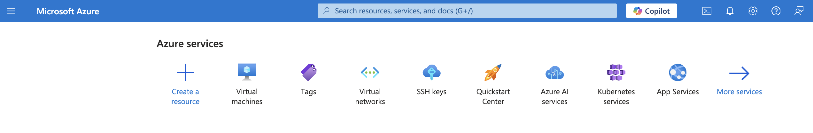

then


3) set the appropriate name, cpu specs, security type and OS ("Ubuntu Server 22.04LTS - Gen 2")

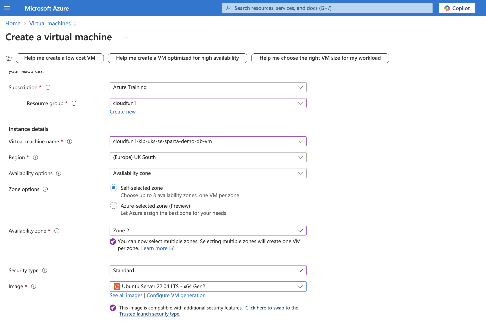

4) set the appropriate username, public key (already uploaded to Azure), and basic ports (22, 80)

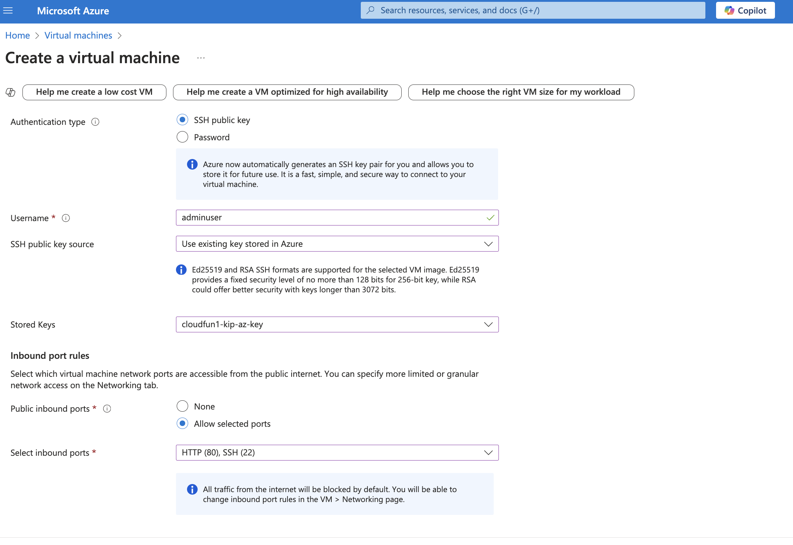

5) set the appropriate standard SSD disk type

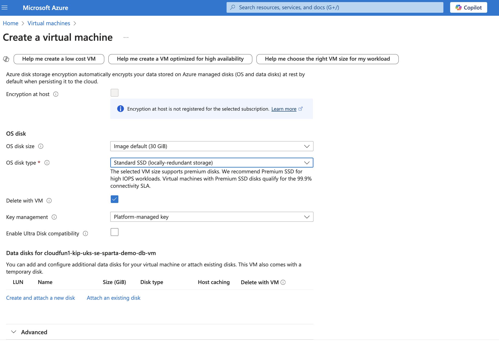

6) set the network parameters. NOTE: be extra careful setting these parameters as they can't be changed later (like you can with ports). Pay particular attention to the Virtual Network (make sure it's in your vnet not someone else's). Also, make sure to tick the option "Delete public IP and NIC when VM is deleted".

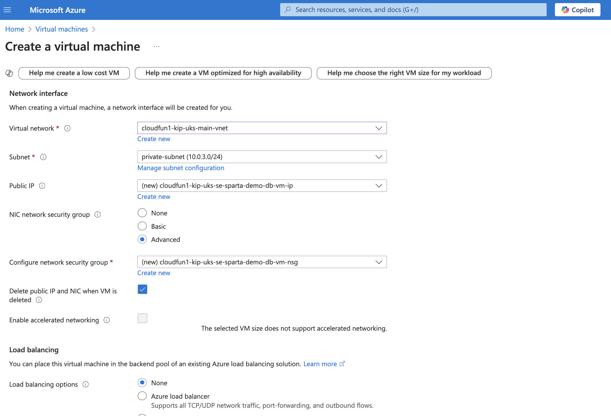

7) set the tags such that the Owner is your name. This makes it easy to identify your resources in Azure (which can be useful when stopping/removing or deleting them later)

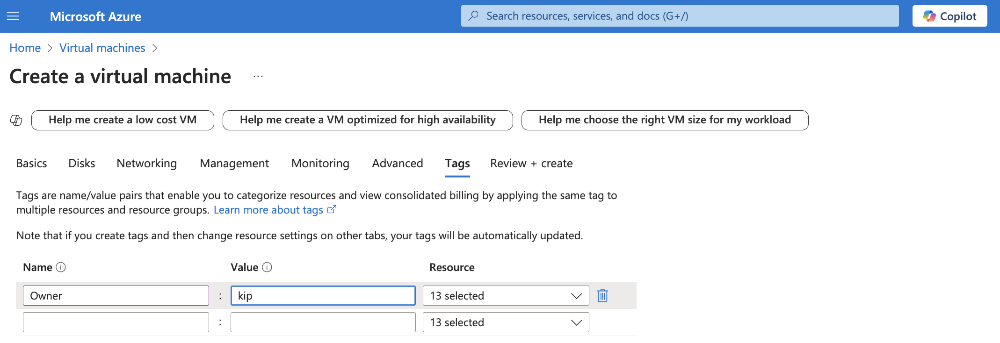

8) review your settings before creating the VM. If they are correct, click "Create". The resources will now be deployed, this takes about a minute or so to complete. 

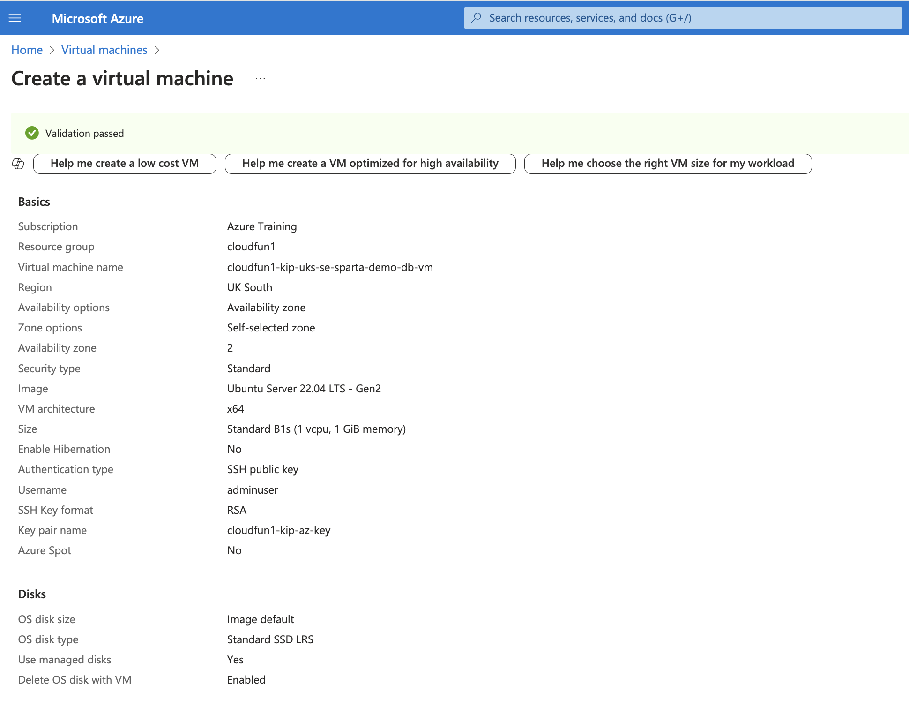

9) after creating the VM, get the external and internal IPs, you will need them shortly

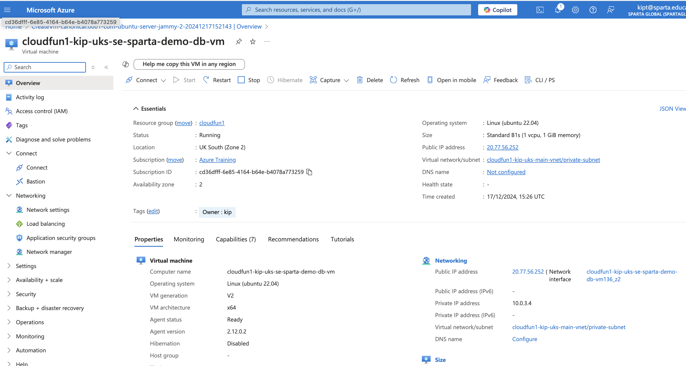

10) establish a ssh into the "db" vm, using the external IP noted above

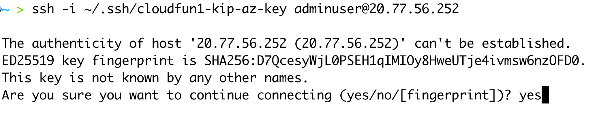

The code for this is:
```
ssh -i ~/.ssh/cloudfun1-kip-az-key adminuser@20.77.56.252
```
NOTE: the -i parameter passes the location of your private key argument to the ssh command. 

You will be prompted to accept the the host wtih the external IP of the "db" vm. Type "yes" to accept and continue onwards.

11) provided that is successful, you can open a new terminal from your local macine and copy (via the rsync command) the db_prov.sh BASH setup script to the "db" vm. Run the appropriate code:

```
rsync -aPrh --append -e "ssh -i ~/.ssh/cloudfun1-kip-az-key" ./db_prov.sh "adminuser@20.77.56.252:/home/adminuser/"
```
NOTE: ammend the path to the db_prov.sh script according to your location. In my instance, the script was in the current working directory.

If the rsync file transfer is successful, the output will be similar to:
```
sending incremental file list
db_prov.sh
          2.01K 100%    0.00kB/s    0:00:00 (xfr#1, to-chk=0/1)
```

12) returning back to the already-established ssh session to the "db" vm, you can now check the presence of the db_prov.sh script, change the file permissions to execute, and run the script itself. Use the following commands:

```
adminuser@cloudfun1-kip-uks-se-sparta-demo-db-vm:~$ ls
db_prov.sh
adminuser@cloudfun1-kip-uks-se-sparta-demo-db-vm:~$ chmod +x db_prov.sh
adminuser@cloudfun1-kip-uks-se-sparta-demo-db-vm:~$ ./db_prov.sh
```
13) when the db_prov.sh has finished running, it will print out the status of the mongoDB serivce (it should be active and running) and also the IP address of the internal IP of the "db" vm. Make a note of this if you haven't earlier (step 9).


### 2. the "app" vm

The process is similar to the "db" vm. I will therfore include screenshots and only written notes where new material is added or is different.

1) create the "app" virtual machine


and

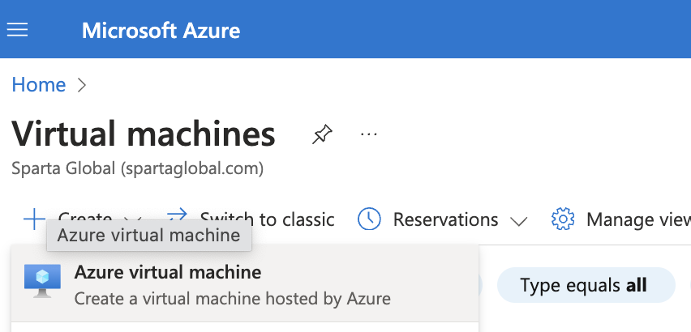

2) set the name, cpu specs and OS etc

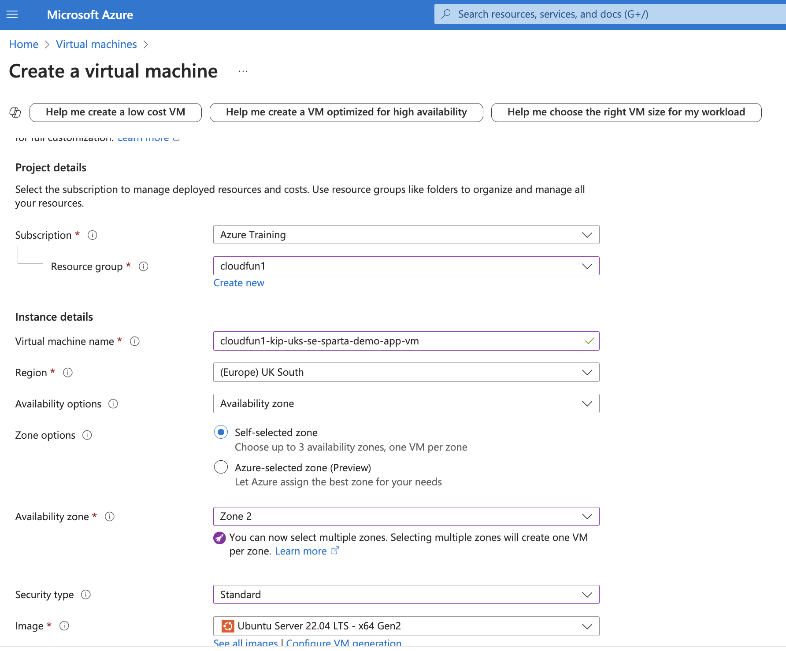

3) set the use of your public key

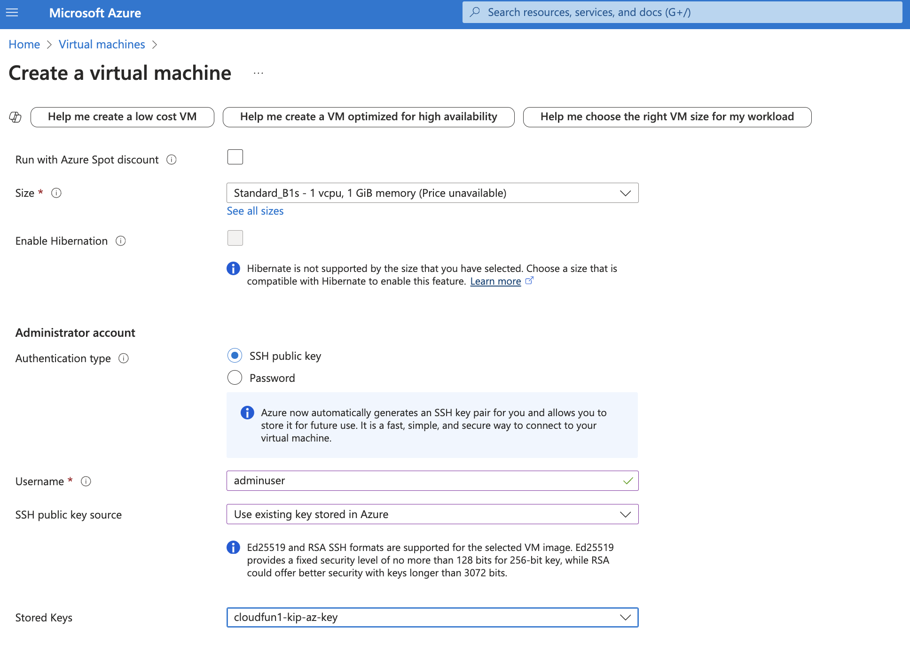

4) set the open basic ports

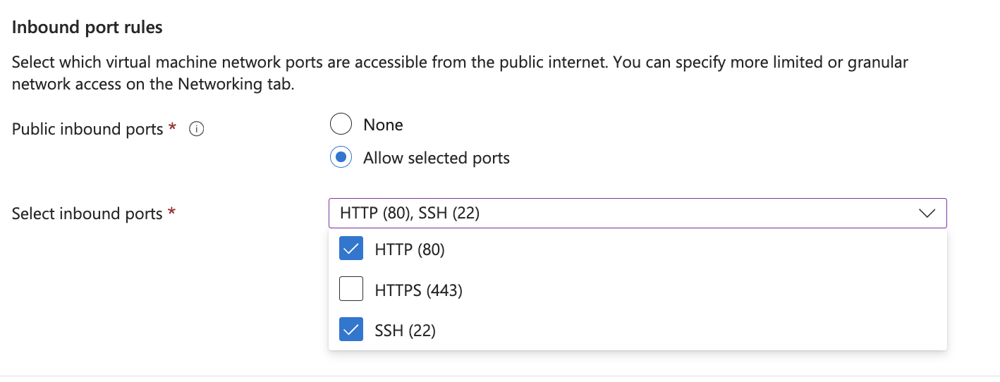

5) set the disk type

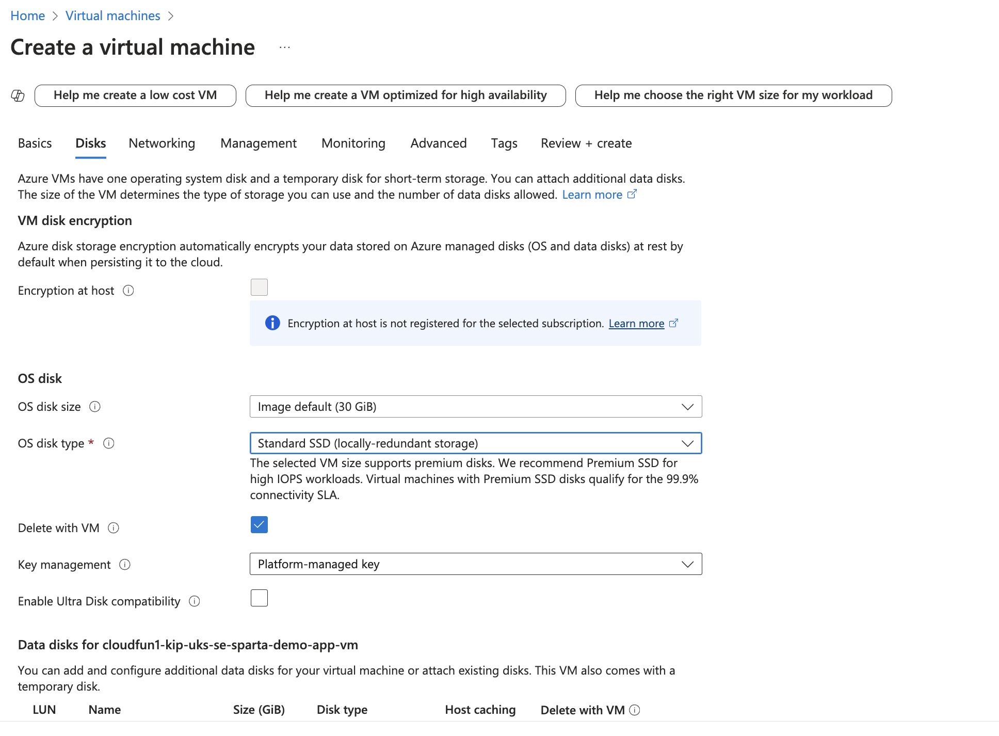

6) set the network parameters. Again, be careful to set the correct overall virtual network, the correct public subnet, and create a new network security group. Make sure to add port 3000 into this, since the node.js app will be communicating on port 3000. 

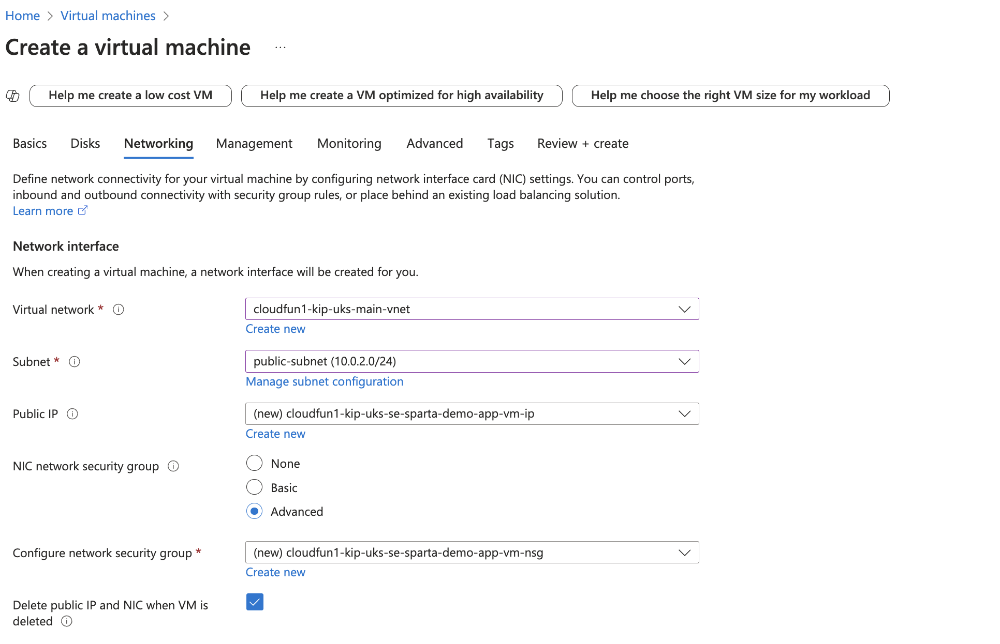

7) set the appropriate tags as before

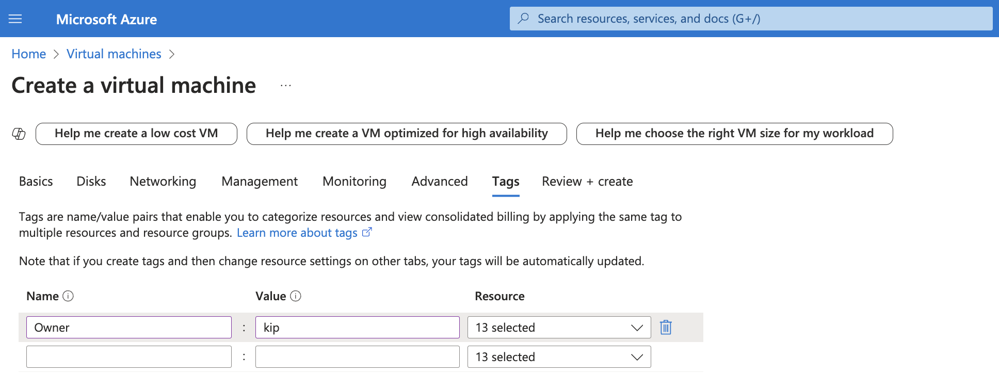

8) review the settings and watch the deployment in progress. 

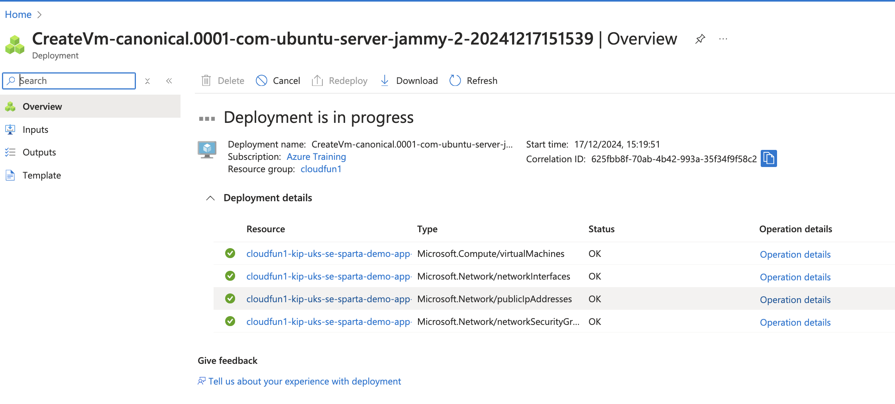

9) once the deployment is completed, make a note of the external IP which you will need to enter in your browser later on (once the app has been deployed). You do not need the internal ip (the one on the public subnet in this instance like you did for the "db" vm)

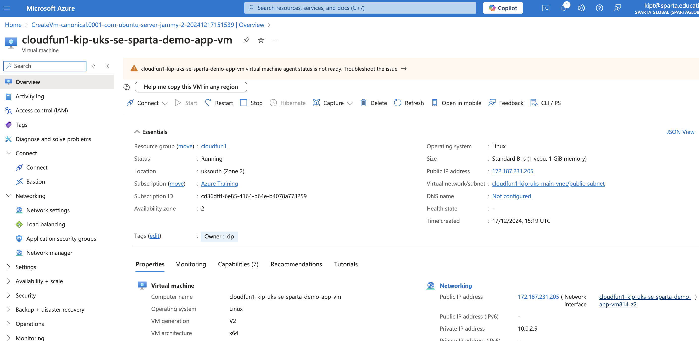

10) ssh into the "app" vm to verify connectivity, using the following code

```
ssh -i ~/.ssh/cloudfun1-kip-az-key adminuser@172.187.231.205
```
Again, accept the new connection when prompted by typing "yes".

11) update the app deployment script "app_prov.sh" with the IP address of the internal IP of the "db" vm. By internal I mean internal to the vnet, and in this case, the IP belonging to the private subnet. The code on line 10 adds this IP address as an Environment Variable to the shell session that will run the app, and as an Environment Variable the information it contains is accessible to any program that could use it to locate the database host:

```
export DB_HOST=mongodb://10.0.3.4:27017/posts
```
This code says:

- export    :   add to .bashrc
- DB_HOST   :   the host of the database
- 10.0.3.4  :   the IP address of the "db" vm running the database
- 27017 :   the port that a single server can communicate on with the mongoDB database
- /posts    :   the specific resource provided by the database

12) from your other terminal window (the one that is not logged into the "app" vm), perform an rsync transfer of the script "app_prov.sh" to the "app" vm using the following code (amend as appropriate to the location of the "app_prov.sh" script). The result should be clearly identifyable and positive:

```
rsync -aPrh --append -e "ssh -i ~/.ssh/cloudfun1-kip-az-key" ./app_prov.sh "adminuser@172.187.231.205:/home/adminuser/"
sending incremental file list
app_prov.sh
          2.59K 100%    0.00kB/s    0:00:00 (xfr#1, to-chk=0/1)
```

13) from the terminal with the active ssh session to/on the "app" vm, verify that the "app_prov.sh" is present by listing it, then make it executable by changing the file mode, and finally run the script directly:

```
ls -la
sudo chmod +x ./app_prov.sh
./app_prov.sh
```

14) the script will now:
    
    - install the app from my repository "https://github.com/umbongodrink/cloudfun1-sparta-app/"
    - install nginx and make the connection to the database

15) verify everything is complete:

    - check the basic URL of the app, using the following syntax in your browser:
```
  http://<EXTERNAL_IP_ADDRESS_OF_APP_VM>
```

This should return the basic and default nginx webpage:

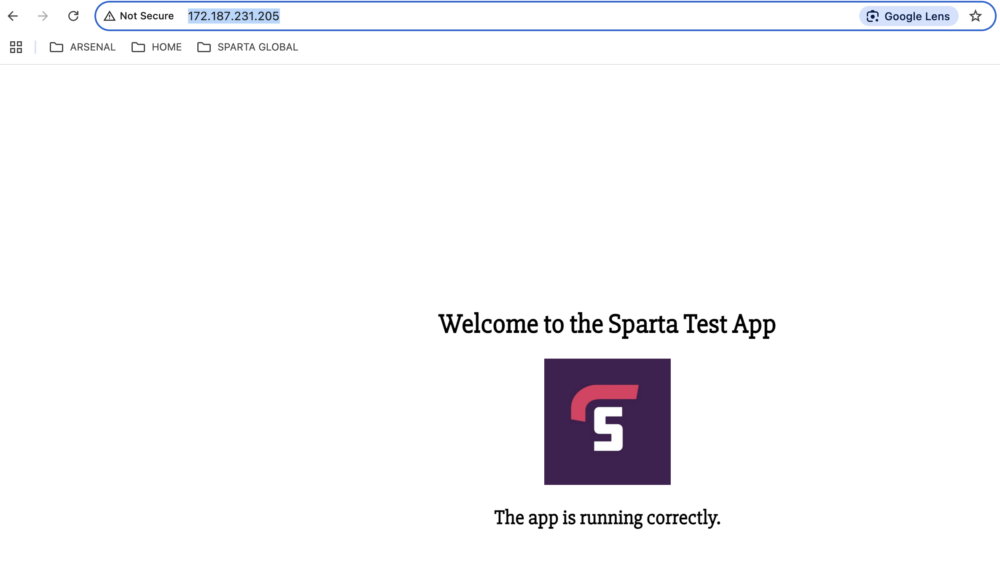

You should see the message that the Sparta Test App is running correctly. 

- check that the posts URL is displaying correctly in the browser, by routing through the reverse-proxy nginx service:

```
  http://<EXTERNAL_IP_ADDRESS_OF_APP_V/posts>
```

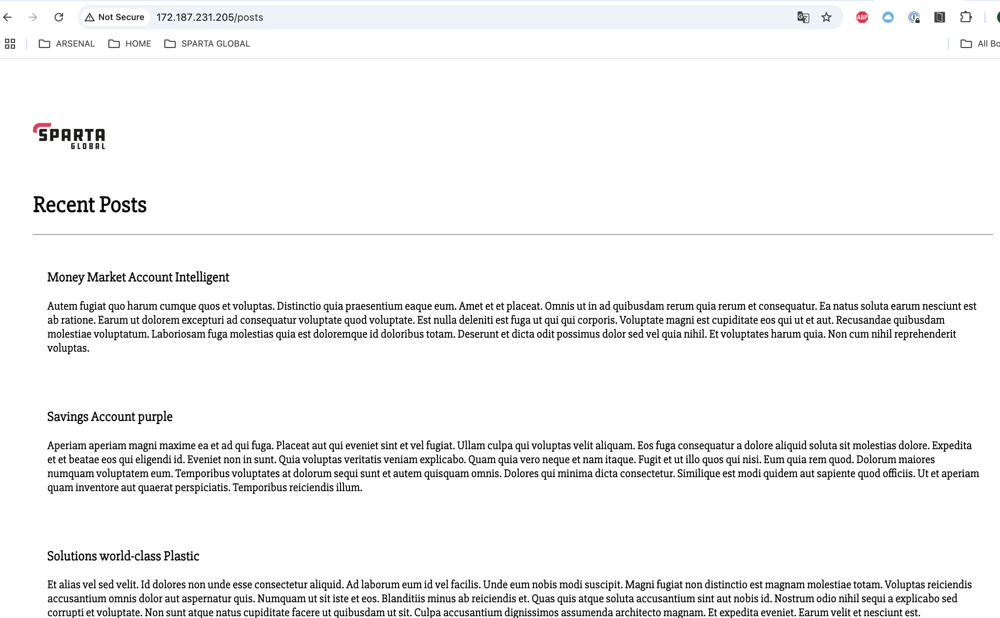

NOTE: there is no reference to port 3000 in the URL here - this means the reverse-proxy is functioning correctly! The client computer making the request has no need to enter an awkward URL that contains 3000. Indeed, the client has no knowledge that the port forwarding or redirection is taking place. 


## From manual to automation:


The goal of the scripts "db_prov.sh" and "app_prov.sh" are, being ran, to streamline into an automated process a number of BASH terminal commands that, one-by-one, configure the various parameters, install the various programs, enable the various services, and initiate the appropriate communication. 

Each of the scripts contain brief, one-line explanations (called "Comments", marked with a hash "#" symbol) that tell the user what each command is doing. This is part of my documentation, and should be noted. The comments are marked with a hash so that they are not interpreted as commands by the BASH shell. 

Each command can be run one-at-a-time as single entities in a step-by-step linear fashion from the command-line ssh session on each appropriate machine, should the user so wish. In fact, this is exactly how the script was built, by literally building a list of commands, and then executing that list. 

Both scripts can be found in the *sparta_app_deployment* directory of the *seskillscamp_cloud_linux* repo that you are looking at.


