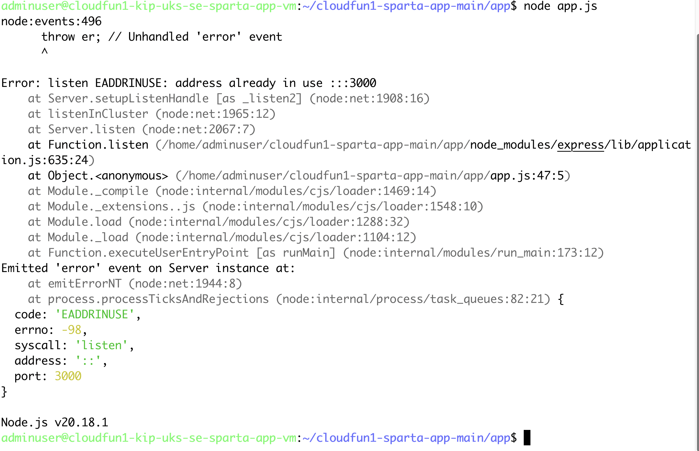

# How many services can use a port?

## What error do you get when you try to run another instance of the sparta app?



```
adminuser@cloudfun1-kip-uks-se-sparta-app-vm:~/cloudfun1-sparta-app-main/app$ node app.js
node:events:496
      throw er; // Unhandled 'error' event
      ^

Error: listen EADDRINUSE: address already in use :::3000
    at Server.setupListenHandle [as _listen2] (node:net:1908:16)
    at listenInCluster (node:net:1965:12)
    at Server.listen (node:net:2067:7)
    at Function.listen (/home/adminuser/cloudfun1-sparta-app-main/app/node_modules/express/lib/application.js:635:24)
    at Object.<anonymous> (/home/adminuser/cloudfun1-sparta-app-main/app/app.js:47:5)
    at Module._compile (node:internal/modules/cjs/loader:1469:14)
    at Module._extensions..js (node:internal/modules/cjs/loader:1548:10)
    at Module.load (node:internal/modules/cjs/loader:1288:32)
    at Module._load (node:internal/modules/cjs/loader:1104:12)
    at Function.executeUserEntryPoint [as runMain] (node:internal/modules/run_main:173:12)
Emitted 'error' event on Server instance at:
    at emitErrorNT (node:net:1944:8)
    at process.processTicksAndRejections (node:internal/process/task_queues:82:21) {
  code: 'EADDRINUSE',
  errno: -98,
  syscall: 'listen',
  address: '::',
  port: 3000
}

Node.js v20.18.1
adminuser@cloudfun1-kip-uks-se-sparta-app-vm:~/cloudfun1-sparta-app-main/app$
```

===> Youget teh error because you are tryng to get a second app instance to use port 3000 but it's already in use by the first app instance.

## Find the Linux command that allows you to find out the process using port 3000?

```
netstat -tulpn | grep :3000
```
which outputs
```
tcp6       0      0 :::3000                 :::*                    LISTEN      1716/node
```

## Fix the error - how will you get ride of the first app process running?

```
kill -1 1716
```
use the kill command on the PID given by the netstat command

