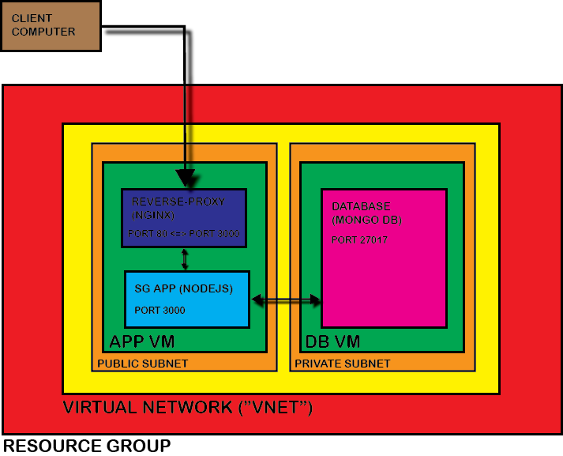

# ARCHITECTURAL OVERVIEW

 

These instructions document the deployment of the Sparta Global app. In higher-level terms, the app comprises three parts:

- a mongoDB database
  
- the app itself, written in node.js
  
- the reverse-proxy running on nginx

 

CONSTRUCTION: the 3 services are spread over two Virtual Machines ("VMs"): 

A "db" VM runs the database. It is placed in a private subnet within the larger virtual network ("vnet"). The idea of putting it in the private subnet is to increase the security of the database (which plays the essential role in storing data) by limiting the access of traffic to and from it.

An "app" VM serves both the Sparta Global app and the nginx performing the reverse-proxy service. This VM is placed in the public subnet of the vnet, and client traffic is directed to it. 

- The Sparta Global app retrieves information from the database on port 27017. The app communicates any client requests over port 3000.

- The nginx reverse-proxy redirects any client requests on port 80 to port 3000. Thus, the client has no need to enter port 3000 in its web-browser URL. 

By placing the app VM in the public subnet, client traffic can be safely directed to it. The reverse-proxy also offers a degree of security by acting as an effective middle-man, and on larger-scale deployments, it can do load balancing as well. However, these last two points are out of the scope for this project.

 

Both these two VMs are privisioned in the Azure cloud. The cloud platform allows apps to be deployed in a scalable manner, where the number of app instances is able to be expanded horizontally (the number of them increases) if there are more client requests than the present provision can serve. 

The login URL for Azure is:

https://azure.microsoft.com/en-gb/get-started/azure-portal

 
 
RETURN TO [README](../README.md)

