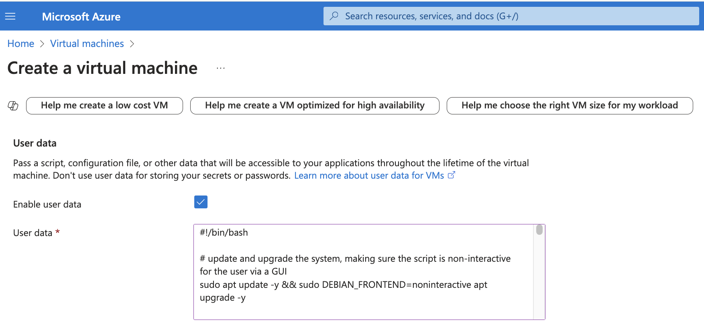

# AZURE USER DATA

After successful deployment of the two VMs by means of [BASH scripts](BASH_SCRIPTS.md), it is possible to get gains of simplicity and speed by using a function of Azure called "User Data". Essentially, you pass your script to this function by simply copying the text of the script into the appropriate box on the Azure Web Portal, when creating your VM:

After you have verified your settings of the VM are correct and click "Create", Azure will provision the VM and then run the pasted script text. 

When done correctly, this removes the manual stages of copying the script into the VM (either using SCP or via rsync), changing the permissions on it to executable, and then running it. 

However, sometimes it is necessary to determine if the script has completed. This may yet involve ssh'ing in, and running terminal commands to verify the status of daemon services or of running app ("node") processes. So full automation may not easily be achievable using User Data. Please see the section on [Technical Hurdles and Blockers](TECHNICAL_HURDLES_AND_BLOCKERS.md) for more information. 

If the User Data stage can be reliably performed, more automation gains of simplicity and speed can be gained from using [Custom Images](CUSTOM_IMAGES.md).