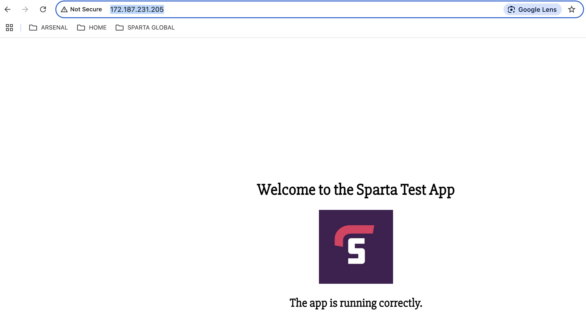
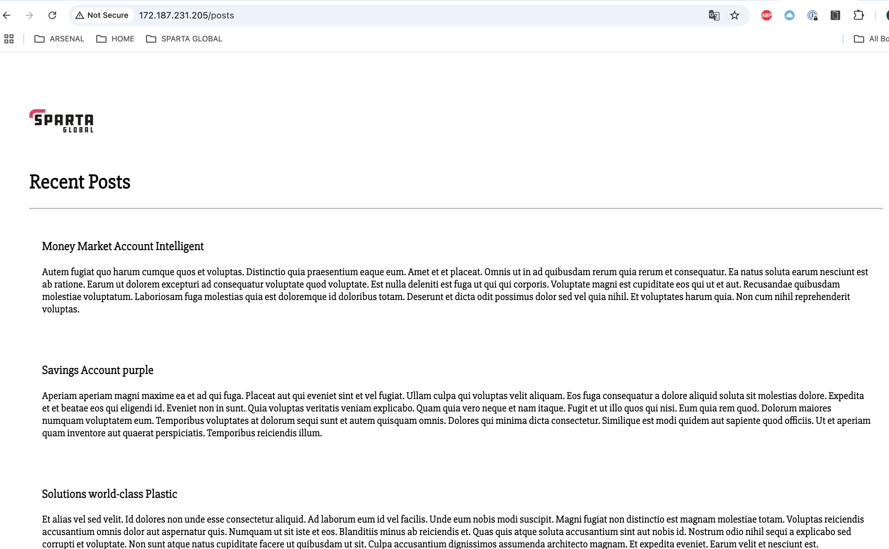

# BASH SCRIPTS

As referred to in the [MANUAL STAGE OF DEPLOYMENT](MANUAL_STAGE_OF_DEPLOYMENT.md) document, the BASH scripts that are used for this project are:

- [db_prov.sh](../sparta_app_deployment_scripts/db_prov.sh)

and

- [app_prov.sh](../sparta_app_deployment_scripts/app_prov.sh)

<br>

## Result of running the scripts

When the scripts are ran, the db_prov.sh script will leave the "db" VM in a state in which the mongod (daemon) service is running and actively listening for requests from the Sparta Global app. 

If you issue the command 
```sudo systemctl status mongod```
you should see this accordingly

It is important that the db VM is set up before the app VM, since it is a requisite for functionality. Once you have the db running, and the mongod service listening for requests, you can run the app_prov.sh script on the app VM. 

When the app_prov.sh script is successful, you should now be able to make http requests from you client computer. The output will be as follows:

- as a basic http request:



- as a request of the database using the /posts URL



<br>

Ultimately, the successful outcome is for the client computer to issue a request over http and get information provided by the database, which you can see here. There should be no reference to port 3000, since the reverse-proxy service (running on nginx) intercepts the standard port 80 request and forwards it to the app on port 3000. 

With that goal achieved, we can now look to streamline the project by adding automation. This simplifies and speeds up deployment of the VMs. 

There are two ways of doing this at this stage:

1) by using Azure User Data

2) by building Custom Images
