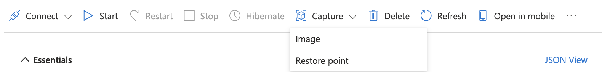
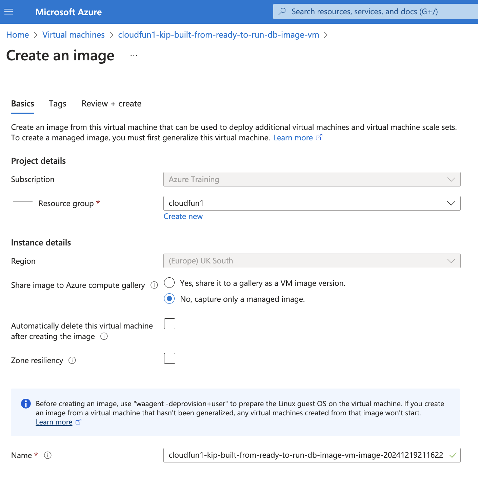
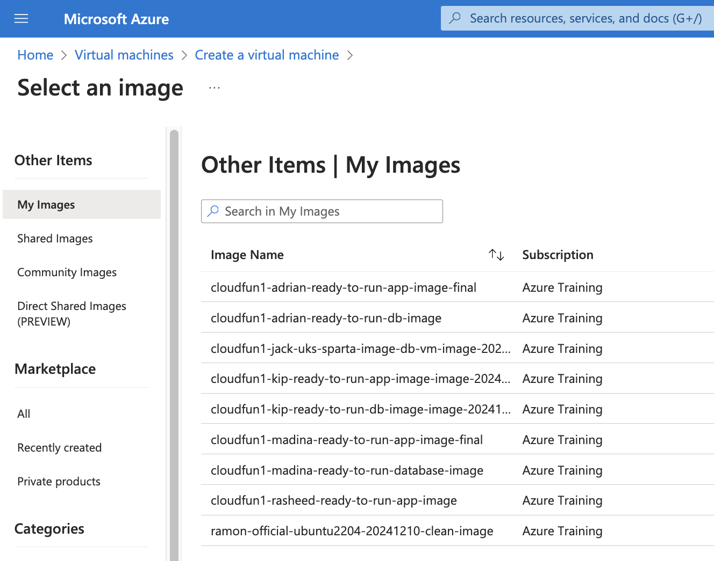

# CUSTOM IMAGES

When deploying VMs on Cloud platforms such as Azure, one chooses the "base image" from a list of possible Operating System candidates. These candidates may be made by OEM software manufacturers such as Microsoft (which provides Windows), or Canonical (which provies Ubuntu Linux), or other companies and people may use the versions provided by the OEM manufacturers and add their own levels of customisation (by adding or removing software, for various aims). 

A base image is therefore a state of an Operating System, plus any software the particular maker has chosen to include. Up to this point, we have used "Ubuntu Server 22.04LTS - Gen 2", and installed our Sparta Global app on top (either via [BASH scripts](BASH_SCRIPTS.md) or via [Azure User Data](AZURE_USER_DATA.md)). 

However, it's perfectly possible to make our own "custom image" of our properly configured and running VMs, in order that they become the template for more VMs of the same type. In this way, we are able to scale our VMs and therefore the data throughput and productivity, enabling us to service more client requests. Furthermore, by using the template we are able to gain deployment advantages of yet more simplicity and speed.

<br>

1. **Creating a Custom Image**: once you have the two successfully running VMs, you click "Capture Image" from the Overview page of the VM, and save it accordingly.



then



2. **Building from the Custom Image**: you use your saved image to as effectively a new "base image" when building more VMs. From the image selection drop down menu, you choose "See All Images" > "My Images > and then choose your own one:



After that you proceed to create your VM in the same manner defined in [Azure Provisioning](AZURE_PROVISIONING.md).

3. Once the new VMs are deployed and running, it may be necessary to add some small bespoke configuration to each so that the app VM knows where the db VM is. By this I mean, you need to ssh into the app VM and issue the command:

```
export DB_HOST=mongodb://<INTERNAL_IP_OF_DB_VM>:27017/posts
```

The app VM will now request information from the db VM from its Private Subnet IP, the one you pasted in the command above.

Again, if a client computer can successfully browse to http://<EXTERNAL_IP_OF_APP_VM> and http://<EXTERNAL_IP_OF_APP_VM>/posts, and get valid results (the "Welcome to the Sparta Test App" message, and the database page), then you have achieved deployment by means of using Custom Images!

