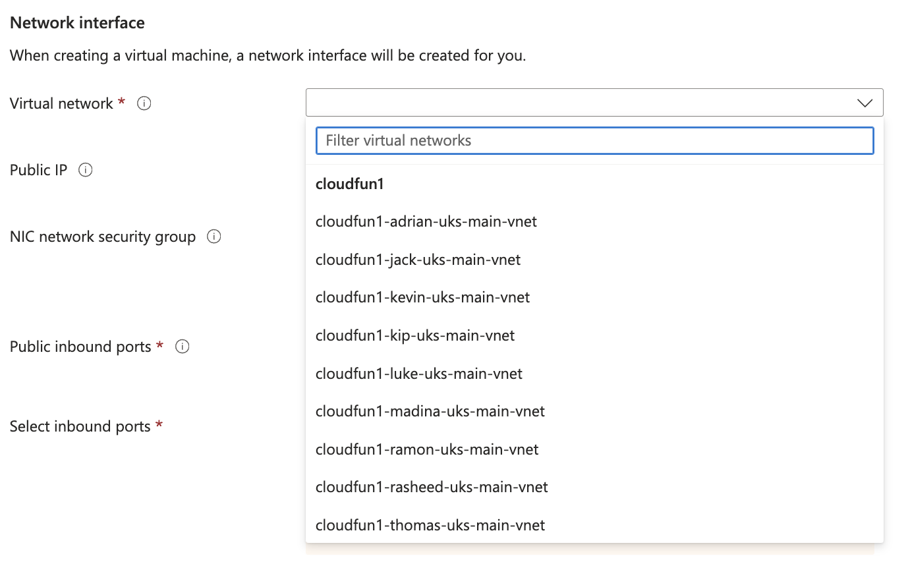

# TECHNICAL HURDLES AND BLOCKERS

There were various issues I encountered during the life of this project, the two most important of which I am documenting here.

<br>

## Choosing the correct Virtual Network ("vnet")

When provising the VMs, a lot of settings can be changed after the fact, meaning after the VM has been created. Items such as the ports the VM will have open can be altered to allow more flow of communication on the new ports you want to add. However, the Virtual Network is the overall network architecture in which the VMs live. If you choose the incorrect vnet for one of the VMs, then data traffic and communication simply will not happen between the VMs. This happened to me when I accidently chose to use a colleague's vnet for one of my VMs instead of my own. As such, the app VM could not make requests of the db VM, and so no valid /posts requests were able to be returned to the client computer. This took quite a bit of time to solve, and should be warned against. 



<br>

## User Data and its unforgiving nature

I had various early versions of my [BASH scripts](BASH_SCRIPTS.md) ([db_prov_OLD.sh](../sparta_app_deployment_scripts/OLD/db_prov_OLD.sh) and [app_prov_OLD.sh](../sparta_app_deployment_scripts/OLD/app_prov_OLD.sh)) that would work fine when ran from an ssh session on each VM. These earlier versions had what one could consider reasonably useful information:

```
# DATE TESTED:
# TESTED BY:
# IMAGE:
# BEST PRACTICES:
```
These headings of these comments could add vital info during the life of the Sparta Global app as it evolves over time. However, I definitely found that having these comments caused issues: the VM would be deployed but the code would hang mysteriously and therefore the various services would not eventually run. 

As a result, I found I had to make the final scripts [db_prov.sh](../sparta_app_deployment_scripts/db_prov.sh) and [app_prov.sh](../sparta_app_deployment_scripts/app_prov.sh) as lean as possible, so that the User Data stage would successfully run and the various services would be available on each VM. *PLEASE USE THESE SCRIPTS!*

I'm disappointed slightly with the seemingly fragile nature of the [User Data](AZURE_USER_DATA.md) experience. I must have lost about 4 hours to troubleshooting code that would not run (when it should - after all, those lines are merely comments, aren't they?).

I guess this is why modern automation deployments use other tools in preference, for example Ansible or Terraform. 